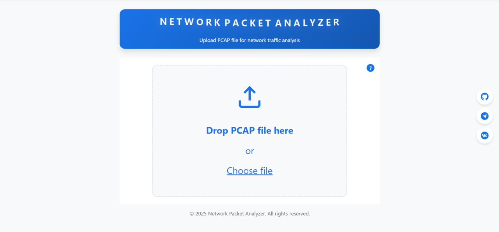

# Описание проекта

## Обзор

Этот проект представляет собой приложение для анализа сетевых пакетов, построенное с использованием Python и Go. Основная цель приложения — анализировать файлы формата PCAP и предоставлять результаты анализа через API.

## Пример пользовательского интерфейса

## Архитектура

Проект состоит из двух основных компонентов:

1. **Python приложение**: Использует FastAPI для предоставления API интерфейса. Оно принимает файлы PCAP, отправляет их на анализ и возвращает результаты.

2. **Go приложение**: Обрабатывает задачи анализа сетевых пакетов, полученные через NATS, и возвращает результаты обратно в Python приложение.

## Используемые технологии

- **Docker**: Для контейнеризации приложений и управления зависимостями.
- **Docker Compose**: Для оркестрации многоконтейнерных приложений.
- **FastAPI**: Для создания API интерфейса в Python.
- **NATS**: Для обмена сообщениями между Python и Go приложениями.
- **Go**: Для выполнения анализа сетевых пакетов.
- **Gopacket**: Библиотека для работы с сетевыми пакетами в Go.

## Статический анализ

- **mypy**: Используется для статической проверки типов в Python коде.

## Запуск проекта

1. Убедитесь, что у вас установлен Docker и Docker Compose.
2. Склонируйте репозиторий проекта.
3. Выполните команду `docker-compose up --build` для сборки и запуска всех сервисов.
4. API будет доступен по адресу `http://localhost:8000`.

## Доступные endpoints

- **Основной API**: `http://localhost:8000` — основной интерфейс API приложения.
- **Документация API**: `http://localhost:8000/docs` — Swagger UI с интерактивной документацией API.

## Очистка Docker окружения

- Остановка всех контейнеров: `docker stop $(docker ps -a -q)`
- Удаление всех контейнеров: `docker rm $(docker ps -a -q)`
- Удаление всех образов: `docker rmi $(docker images -q)`
- Полная очистка системы: `docker system prune -a --volumes`
